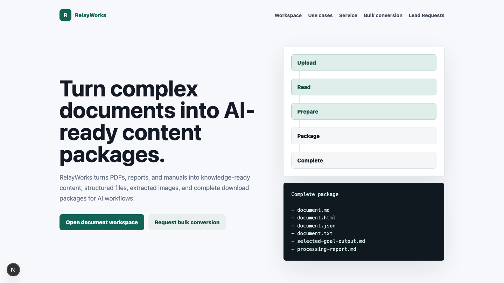
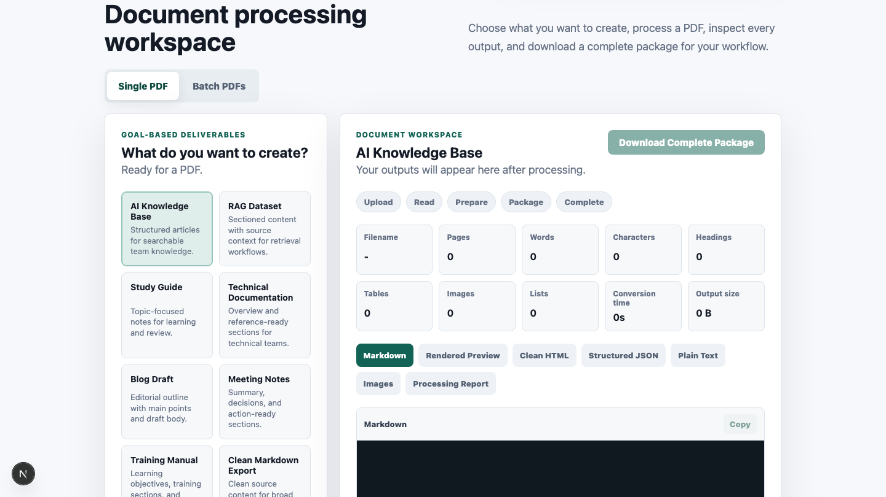
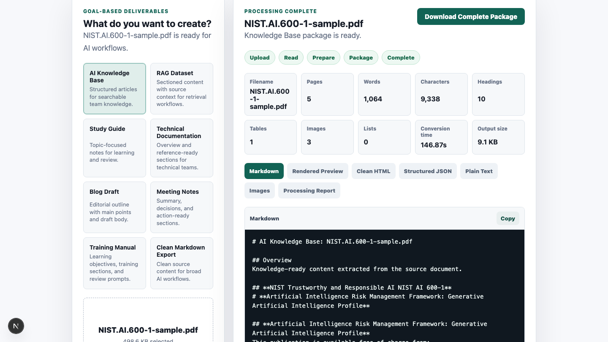
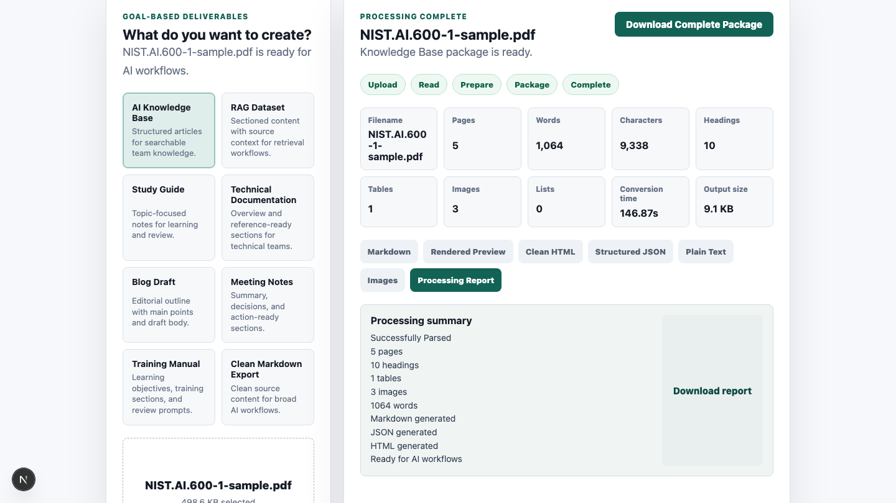

# RelayWorks Document Processing Kit

Build AI-ready document pipelines without spending weeks assembling open-source components.

RelayWorks Document Processing Kit is a self-hosted developer product that transforms PDFs into structured Markdown, HTML, JSON, plain text, extracted images, processing reports, and downloadable output packages.

> This is a public showcase repository for product evaluation. The paid FastAPI and Next.js source code is distributed through Gumroad after purchase and is not included in this repository.

## Inspect Real Outputs

[Download the RelayWorks Sample Output Pack](https://raw.githubusercontent.com/DevCalebR/relayworks-document-processing-showcase/main/sample-output/relayworks-sample-output-pack.zip) to inspect real results from the local Knowledge Base workflow. The ZIP contains:

- Markdown, HTML, structured JSON, and plain-text outputs
- A processing report and goal-oriented output
- Three extracted images
- Source, redistribution, workflow, and quality notes

Explore RelayWorks at [getrelayworks.com](https://getrelayworks.com) or **[Buy Now](https://calebroge5.gumroad.com/l/djzlrg)**.

## Buy RelayWorks

- Website: [https://getrelayworks.com](https://getrelayworks.com)
- Gumroad: [RelayWorks AI Document Processing Kit](https://calebroge5.gumroad.com/l/djzlrg)
- **[Buy Now](https://calebroge5.gumroad.com/l/djzlrg)**

## Why it exists

Document-heavy AI products often need the same foundation before any model or retrieval system can be useful: PDF ingestion, conversion jobs, structured outputs, export packages, and a simple review workflow. Building that baseline from scratch can turn into weeks of glue code across parsers, APIs, frontend state, file handling, and download logic.

RelayWorks gives developers a working self-hosted starting point for turning PDFs into files that can feed RAG systems, internal knowledge bases, training workflows, document cleanup processes, and other AI-ready content pipelines.

## Who it is for

- AI developers preparing documents for RAG or knowledge-base ingestion.
- Agencies building document conversion workflows for clients.
- Internal tools teams that need local PDF processing without sending sensitive files to a hosted SaaS.
- Operators who need inspectable Markdown, JSON, HTML, text, reports, image exports, and ZIP packages from source PDFs.
- Builders who want complete FastAPI and Next.js source code they can inspect, run, and adapt after purchase.

## Main benefits

- Save weeks of development by starting from an assembled PDF processing kit.
- Avoid wiring together several document-processing components yourself.
- Keep sensitive documents on the buyer's own machine or infrastructure.
- Receive complete FastAPI and Next.js source code after purchase.
- Generate multiple structured output formats from a PDF-first workflow.
- Support document ingestion, RAG preparation, knowledge bases, and internal AI workflows.

## Local and self-hosted processing

RelayWorks is designed as a self-hosted developer product, not a hosted SaaS account. Buyers run the application in their own local or server environment and keep document processing under their control.

The product does not include hosted authentication, billing, cloud storage, multi-tenant administration, or enterprise compliance features. It is a source-code kit for developers who want a practical baseline they can own and adapt.

## Supported outputs

RelayWorks focuses on PDF-to-output-package workflows. The paid kit is described as producing:

- Markdown
- HTML
- Structured JSON
- Plain text
- Goal-oriented selected output
- Processing report
- Extracted images
- Downloadable ZIP packages

See [docs/outputs.md](docs/outputs.md) for a more detailed output overview.

## Workflow

1. Choose the output goal for the document.
2. Upload a PDF.
3. Process the file through the local conversion workflow.
4. Review generated Markdown, HTML, JSON, text, report, and extracted-image outputs.
5. Download a complete package for use in AI workflows, knowledge bases, or internal tooling.

## Screenshots

These screenshots are approved public marketing images from the product workflow.

### Homepage

### Goal selection

### Processing complete

### Markdown output

### Structured JSON

### Download package

## Demo video

Watch the approved demo on the [RelayWorks website](https://getrelayworks.com), where it shows the local PDF-to-package workflow. The large source video is intentionally not committed here. See [demo/README.md](demo/README.md) for details.

## Technical stack overview

The paid source-code product is described as a FastAPI and Next.js kit for PDF-first document processing.

- Backend: FastAPI
- Frontend: Next.js and React
- Processing: PDF conversion workflow with structured output generation
- Runtime style: local/self-hosted developer setup
- Outputs: Markdown, HTML, JSON, text, reports, images, and ZIP packages

See [docs/architecture.md](docs/architecture.md) for the public architecture summary.

## Requirements overview

Buyers should be comfortable with local developer tooling. macOS or Linux is recommended, along with Python 3.11, Node.js 20 or 22, npm, Marker installed separately, and local filesystem access.

See [docs/requirements.md](docs/requirements.md) for the public requirements summary.

## Known limitations

- PDF extraction quality depends on the source file and the conversion tooling.
- The product is PDF-first and does not claim support for every document format.
- Scanned documents and complex layouts may require review or additional tooling.
- This is not a hosted SaaS product.
- This showcase repository does not include the paid application source code.
- Authentication, billing, cloud storage, multi-tenant operation, and enterprise compliance are not claimed features of the current kit.

## Frequently asked questions

### Does this repository include the application source code?

No. This public repository is a marketing, documentation, and product-evaluation hub. The paid FastAPI and Next.js source code is distributed through Gumroad after purchase.

### Is RelayWorks open source?

No. RelayWorks Document Processing Kit is a commercial source-code product. This showcase repository should not be read as an open-source release of the commercial application.

### Does it process documents locally?

The product is designed for local and self-hosted processing, so buyers can keep sensitive documents on their own machine or infrastructure.

### Does it guarantee perfect PDF extraction?

No. PDF extraction quality varies by document structure, scan quality, embedded text, tables, images, and parser behavior.

### Does it include hosted SaaS features?

No. Do not expect hosted accounts, production authentication, billing, cloud storage, or multi-tenant administration in the current kit.

### Where can I buy it?

Purchase the source-code kit from the verified [Gumroad product page](https://calebroge5.gumroad.com/l/djzlrg).

**[Buy RelayWorks now](https://calebroge5.gumroad.com/l/djzlrg)**

## Documentation

- [Architecture](docs/architecture.md)
- [Outputs](docs/outputs.md)
- [Use cases](docs/use-cases.md)
- [Requirements](docs/requirements.md)
- [FAQ](FAQ.md)
- [Roadmap](ROADMAP.md)
- [Disclaimer](DISCLAIMER.md)

## Repository scope

This repository intentionally contains only public showcase material:

- Buyer-facing documentation
- Product-evaluation notes
- Approved screenshots
- Demo reference notes

It does not contain proprietary backend code, frontend code, customer ZIPs, environment files, secrets, tokens, private PDFs, generated customer documents, lead records, or local machine paths.
