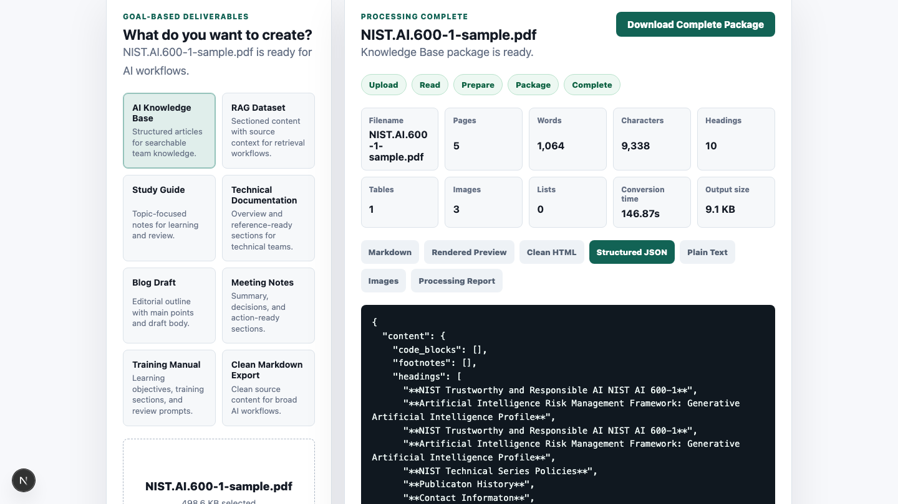
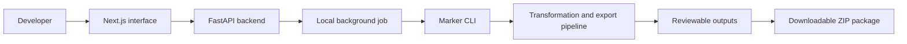

<div align="center">

# RelayWorks Document Processing Kit

### Turn PDFs into reviewable, AI-ready output packages on your own infrastructure.

**A public evaluation repository for a commercial FastAPI and Next.js source-code kit that converts PDFs into Markdown, HTML, JSON, text, reports, extracted images, and ZIP packages.**

[Inspect the sample output](sample-output/relayworks-sample-output-pack.zip) · [View the product](https://getrelayworks.com/document-processing-kit/) · [Buy the source-code kit](https://calebroge5.gumroad.com/l/djzlrg)

  

</div>

> This repository contains public evaluation material, not the commercial application source. Purchase does not turn this showcase into an open-source release.

## Business problem

Document-heavy AI projects repeatedly need the same foundation: PDF ingestion, local processing, structured exports, status tracking, review, and packaging. Building that glue delays the actual knowledge-base, RAG, cleanup, or internal-tool work. RelayWorks provides a working foundation that developers can run and adapt in their own environment.

## Key features

- PDF-first upload and goal-selection workflow
- Local background processing through a separately installed Marker CLI
- Markdown, HTML, structured JSON, plain-text, selected-output, and processing-report exports
- Extracted-image review and downloadable ZIP packaging
- FastAPI backend and Next.js review interface in the paid source package
- Local/self-hosted operation with no required hosted document-processing account
- Real screenshots and a downloadable sample output pack in this repository

## Screenshots

All images below are approved captures from the current product workflow.

| Goal selection | Processing complete |
| --- | --- |
|  |  |

| Markdown review | Structured JSON |
| --- | --- |
|  |  |

Additional captures: [homepage](docs/assets/screenshots/homepage.png) and [download package](docs/assets/screenshots/download-package.png). The approved demo video is linked from [`demo/README.md`](demo/README.md).

## Architecture



Source PDFs and generated outputs remain in the buyer-controlled environment. Proprietary endpoint and transformation details are intentionally omitted here; see [`docs/architecture.md`](docs/architecture.md).

## Tech stack

- FastAPI and Python 3.11 backend
- Next.js, React, TypeScript, Node.js 20 or 22 frontend
- Local background-job orchestration
- Marker CLI installed separately
- Local filesystem output and ZIP packaging

## Installation

There is no runnable application to install from this public showcase. Buyers receive the source package and its installation guide through the [verified product page](https://calebroge5.gumroad.com/l/djzlrg). Public system expectations are documented in [`docs/requirements.md`](docs/requirements.md).

## Configuration

The commercial kit is configured for a local or self-hosted filesystem workflow. This repository contains no `.env` file, credentials, private package configuration, or customer data. Marker is a separate dependency governed by its own terms.

## Evaluating locally

Download [`sample-output/relayworks-sample-output-pack.zip`](sample-output/relayworks-sample-output-pack.zip), extract it, and inspect the Markdown, HTML, JSON, text, report, selected output, images, and provenance notes. This is the fastest evidence path before purchase.

## Deployment

The product is a developer source-code kit rather than a hosted service. Buyers are responsible for their runtime, storage, network exposure, and any production hardening. It does not include hosted auth, billing, cloud storage, multi-tenant administration, or enterprise compliance controls.

## Project structure

```text
screenshots/          Verified product captures
sample-output/        Downloadable output pack for evaluation
demo/                 Approved video reference
docs/                 Architecture, outputs, use cases, and requirements
FAQ.md                Buyer questions and product boundaries
DISCLAIMER.md         Evaluation and third-party dependency terms
ROADMAP.md            Non-binding public directions
```

## Design decisions

- The showcase provides real outputs and screenshots rather than exposing proprietary source.
- Self-hosting keeps file handling under the buyer's control but also makes deployment security the buyer's responsibility.
- Multiple outputs support inspection and downstream workflows; they do not guarantee extraction quality.
- The product remains PDF-first to keep scope and requirements honest.

## Known limitations

- Extraction quality varies with source layout, scan quality, tables, images, and parser behavior.
- Scanned or unusually complex PDFs may need review or additional tooling.
- Marker is installed separately and is not distributed by this repository.
- The kit does not claim hosted SaaS, production authentication, billing, cloud storage, multi-tenancy, enterprise compliance, or perfect OCR.
- This repository cannot be used to build or run the paid application.

## Roadmap

- Add more representative, rights-cleared sample documents and output packs
- Improve buyer installation verification
- Expand validation evidence across representative PDF structures

Roadmap items are exploratory and not promised release commitments. See [`ROADMAP.md`](ROADMAP.md).

## License

Showcase materials and the commercial product are proprietary. Copyright © 2026 Caleb Rogers. All rights reserved. See [`LICENSE`](LICENSE) and [`DISCLAIMER.md`](DISCLAIMER.md).

## Work with me

RelayWorks demonstrates document-processing architecture, FastAPI/Next.js delivery, and AI-ready output design. [Buy the kit](https://calebroge5.gumroad.com/l/djzlrg) or [discuss a custom document workflow](https://getrelayworks.com/contact/).
