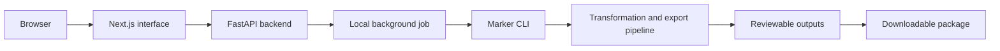

# Architecture

RelayWorks Document Processing Kit is a self-hosted developer product built around a Next.js interface and FastAPI backend.

## Public architecture summary

The browser interface provides goal selection, PDF upload, processing status, output review, and package download. The FastAPI backend coordinates local processing jobs. A local job invokes the separately installed Marker CLI, after which the product's transformation and export pipeline assembles reviewable files and a downloadable package.

Buyers run the workflow in their own environment so source PDFs and generated outputs remain under their control.

## Repository boundary

This overview intentionally excludes proprietary endpoint, parser, job, transformation, export, and packaging implementation details. This public repository contains no backend modules, frontend source, customer files, or generated packages.
